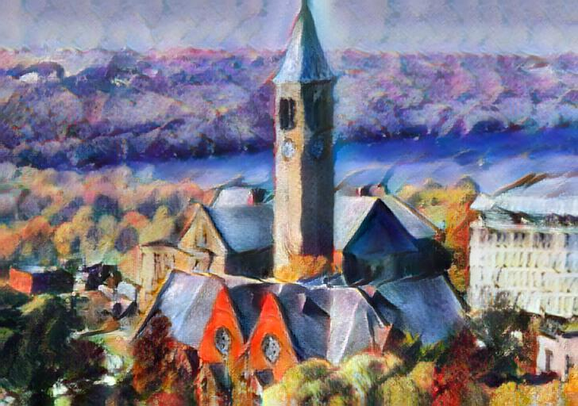

# Overview

Implementation of Arbitrary Style Transfer in Real-time with Adaptive Instance Normalization in Tensorflow

<p align='center'>
    
    
    
</p>

## Paper
https://arxiv.org/abs/1703.06868

## Setup

```
git clone https://bitbucket.org/eleven23/style-transfer
cd style-transfer
virtualenv venv --python /usr/bin/python3
source venv/bin/activate
pip install -r requirements.txt
bash models/get_vgg.sh
```

## Usage

### Basic

Use `--content` and `--style` to provide the respective path to the content and style image, for example:

```
./test.py --content input/content/cornell.jpg --style input/style/woman_with_hat_matisse.jpg --content_size 0 --style_size 0
```

To run the code on directories of content and style images use `--content_dir` and `--style_dir` options. It will save every possible
combination of content and styles to the output directory.

```
./test.py --content_dir input/content --style_dir input/style
```

Other options:

- `--crop`: Center crop both content and style images beforehand.
- `--content_size`: Scale the content image to this size, keeping proportions. Set to zero to keep the original size.
- `--style_size`: Scale the style image to this size, keeping proportions. Set to zero to keep the original size.

To see all available options, type:

```
./test.py -h
```

### Content-Style tradeoff

Use `--alpha` to adjust the degree of stylization. It should be a value between 0 and 1 (default).

### Preserve color

Add `--preserve_color` to preserve the color of the content image. Example usage:

```
./test.py --content input/content/newyork.jpg --style input/style/brushstrokes.jpg --content_size 0 --style_size 0 --preserve_color
```

### Style Interpolation

To interpolate between several style images, provide them as a comma-separated list. You can control the relative weight of each style by using the `--style_interp_weights` option. Example usage:

```
./test.py --content input/content/avril.jpg --style input/style/picasso_self_portrait.jpg,input/style/impronte_d_artista.jpg --style_interp_weights 1,1 --crop --style_size 400
```

### Spatial Control

Use `--mask` to provide the path to a binary foreground mask. You can transfer the foreground and background of the content image to different styles.
Note that you also to need to provide two style images separated be comma, in which the first one is applied to foreground and the second one is applied to background. Example usage:

```
./test.py --content input/content/blonde_girl.jpg --style input/style/woman_in_peasant_dress_cropped.jpg,input/style/mondrian_cropped.jpg --mask input/mask/mask.png --content_size 0 --style_size 0
```

## Training

- Download the wikiart dataset from Kaggle (https://www.kaggle.com/c/painter-by-numbers/download/train.zip), unzip images into `datasets/wikiart/train`
- Download the MS COCO dataset using the included downloader:

```
./datasets/get_coco_train.sh
```

- Prepare datasets for training

```
./prepare_dataset.py datasets/coco/train2014/ datasets/coco/
./prepare_dataset.py datasets/wikiart/train/ datasets/wikiart/
```

- Launch the training script

```
./train.py
```

To see all available options, type:

```
./train.py -h
```

## Acknowledgement

- This implementation is based on the original Torch implementation (https://github.com/xunhuang1995/AdaIN-style)
